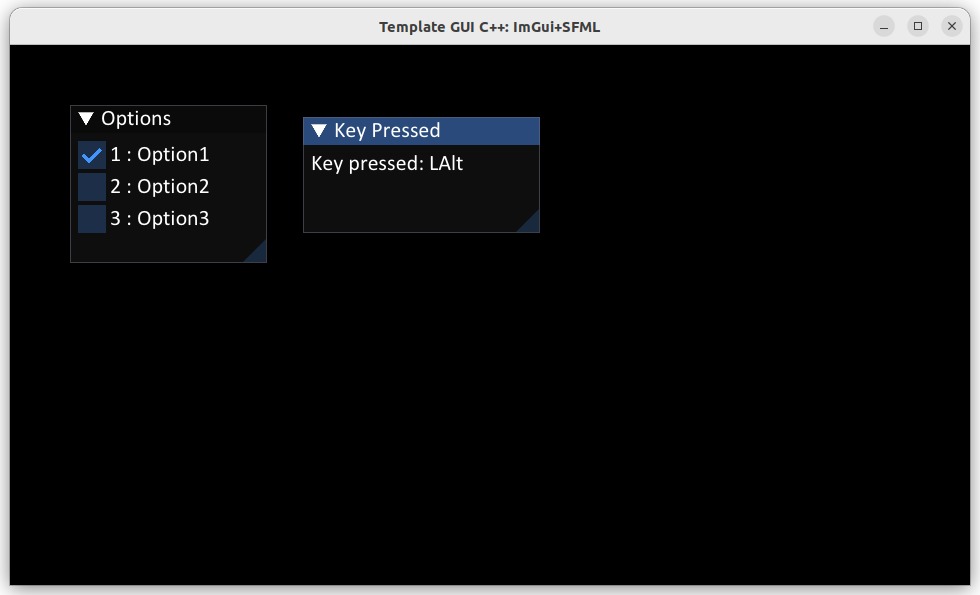

# gui_project_cpp

GUI project in C++ using ImGui-SFML.

| Pipeline |                                                                                                                                                                               Status |
|----------|-------------------------------------------------------------------------------------------------------------------------------------------------------------------------------------:|
| Actions  | [](https://github.com/spjuanjoc/gui_project_cpp/actions/workflows/linux.yml) |

[//]: # (| Coverage | [![codecov]&#40;https://codecov.io/gh/spjuanjoc/gui_project_cpp/branch/main/graph/badge.svg&#41;]&#40;https://codecov.io/gh/spjuanjoc/gui_project_cpp&#41; |)


## Requirements

| Tool  | Version  |
|:------|----------|
| GCC   | >= 8.3.0 |
| Clang | >= 7.0.0 |
| MSVC  | >= 14.16 |
| Conan | 2        |
| CMake | >3.24    |


## Build

1. Build

    ```shell
      mkdir build && cd build
      cmake .. -DCMAKE_PROJECT_TOP_LEVEL_INCLUDES=/path/to/cmake/conan_provider.cmake -DCMAKE_BUILD_TYPE=Debug
      cmake --build .
    ```

2. Run

    ```shell
    ./build/gui_project_cpp
    ```

The expected output is the following main window




## spdlog and fmt::format

See about [spdlog](https://github.com/gabime/spdlog/wiki/3.-Custom-formatting)

## Notes

To install conan: 

```shell
sudo pip3 install conan
```

To install ninja: 

```shell
sudo apt install -y ninja-build
```

## Troubleshooting

1. If required, install extra packages required for ImGui and SFML in Linux:

    ```shell
    conan profile update conf.tools.system.package_manager:mode=install default

    sudo apt install -y \
      libudev-dev                       \
      pkg-config                        \
      libgl1-mesa-dev                   \
      xorg-dev                          \
      libxcb-render-util0-dev           \
      libxcb-xkb-dev                    \
      libxcb-icccm4-dev                 \
      libxcb-image0-dev                 \
      libxcb-keysyms1-dev               \
      libxcb-xinerama0-dev              \
      libx11-xcb-dev                    \
      libxcb-randr0-dev                 \
      libxcb-shape0-dev                 \
      libxcb-sync-dev                   \
      libxcb-xfixes0-dev                \
      libxcb-dri3-dev                   \
      libxcb-cursor-dev                 \
      libxcb-util0-dev
    ```
